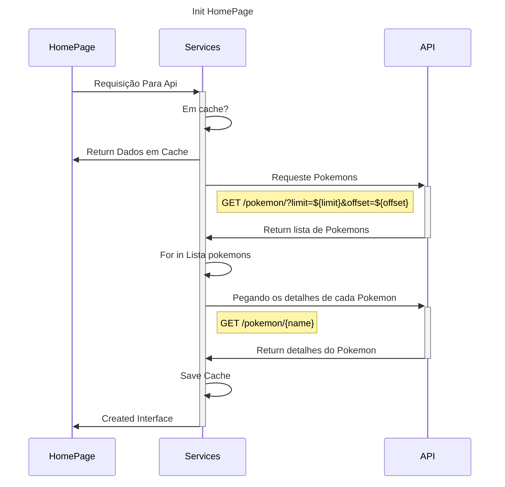
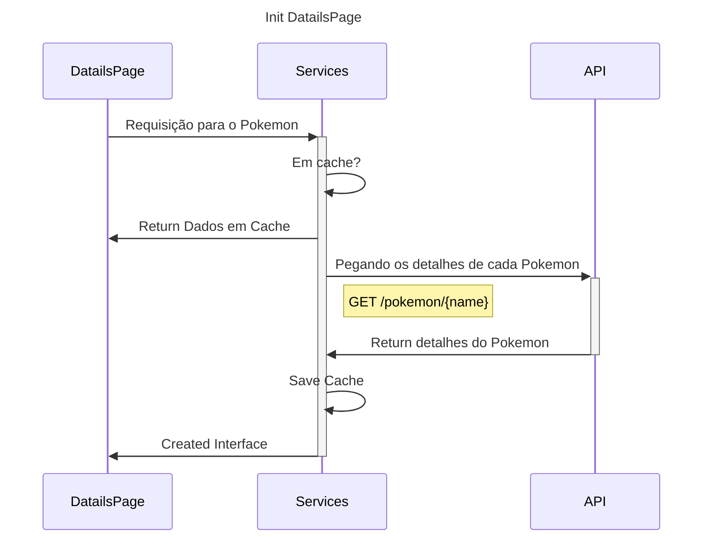

# pokeApi_angula_lonic

## Desafio

Para avaliar suas habilidades técnicas e estilo de codificação, convidamos você a desenvolver um pequeno aplicativo utilizando os serviços RESTful da API pública PokeAPI.

Como participar?
Assim que iniciar esta avaliação, crie um repositório no GitHub com a base do projeto utilizando Ionic com Angular, para que possamos acompanhar seu progresso por meio dos commits.
Escopo do projeto:

Tela principal: Deve exibir o nome e a imagem do Pokémon. O layout fica a seu critério, desde que seja funcional e organizado.

Navegação: Implemente redirecionamento para uma tela de detalhes, conforme descrito no item 3.

Tela de detalhes: Apresente uma lista com no mínimo 6 descrições adicionais e imagens relacionadas ao Pokémon selecionado. O layout pode ser escolhido por você.

Boas práticas: Compartilhe o projeto no GitHub seguindo boas práticas de desenvolvimento, incluindo commits claros e frequentes.

README.md: Inclua um arquivo README com um texto de até 10 frases explicando sua abordagem, estilo de codificação e padrões de design adotados para este projeto.

Dependências: Você pode utilizar bibliotecas de terceiros conforme preferir para facilitar o desenvolvimento.

Paginação: Implemente paginação para a lista de Pokémons ou descrições, garantindo melhor usabilidade.

Injeção de dependência: Utilize esse padrão para gerenciar serviços e dependências no seu código.

Favoritos: Permita que o usuário marque Pokémons como favoritos em uma lista específica.

Responsividade: Adapte a interface para funcionar adequadamente em diferentes orientações de dispositivos móveis (modo retrato e paisagem).
Diferenciais (não obrigatórios, mas que farão seu projeto se destacar):

- Documentação técnica detalhada.

- Implementação de WebHooks.

- Inclusão de mídia no repositório (imagens, vídeos ou GIFs) para demonstrar funcionalidades.

- Testes unitários cobrindo partes importantes do código.

Fique à vontade para adicionar outras funcionalidades ou melhorias que considerar interessantes — surpreenda-nos!

## 🛠️ Diagrama de como inicia a HomePage

## 🛠️ Diagrama de como inicia a DatailsPage

## Services:
    PokemonServices
[PokemonServices](/src/app/services/pokemon.service.ts)
### Atributos: 
- http: HttpClient
- cache: Map<string, Pokemon>
    
### methods:
- **getPokemons**:
    
    Receber um limit e offset e faz uma req /pokemon/?limit={limit}&offset={offset}, e retornado o resultado dessa req

- **getPokemon**:

    Receber o nome do pokemon e fazer uma req para /pokemon/{name}/ caso o {name} não esteja no cache, logo após set {name} no cache, caso esteja em cache retorna cache.get({name})

## Models:
    Pokemon
[Pokemon](/src/app/models/Pokemon.ts)
- Uma interface de dados para mapear e tipa o retornos do Services 